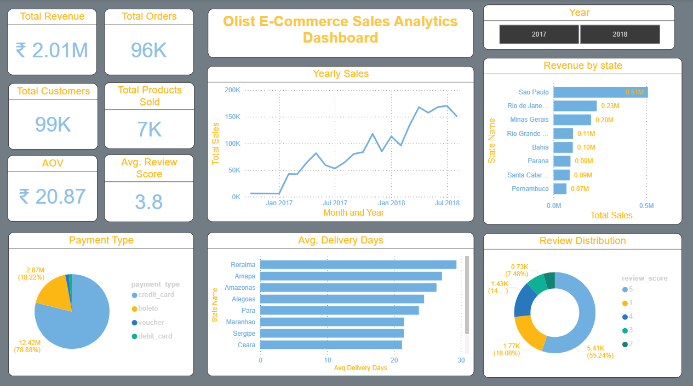

# 📊 Olist E-Commerce Sales Analytics Dashboard

An interactive **Power BI dashboard** built using the **Brazilian Olist E-Commerce Dataset** to analyze sales performance, customer behavior, logistics efficiency, payment trends, and customer satisfaction. The project transforms raw transactional data into actionable business insights through data cleaning, data modeling, DAX calculations, and interactive visualizations.

---

## 📌 Project Overview

The objective of this project is to help business stakeholders monitor key performance indicators (KPIs), identify sales trends, evaluate operational efficiency, and make data-driven decisions using an interactive Business Intelligence dashboard.

This dashboard provides insights into:

- Sales performance
- Customer purchasing behavior
- Payment preferences
- Regional sales distribution
- Delivery performance
- Customer satisfaction

---

## 🎯 Business Problem

E-commerce businesses generate large volumes of transactional data every day. Without proper analysis, it becomes difficult to:

- Track revenue growth
- Identify high-performing regions
- Understand customer purchasing behavior
- Monitor delivery efficiency
- Measure customer satisfaction
- Make informed business decisions

This dashboard addresses these challenges by presenting important business metrics in a single interactive report.

---

## 📂 Dataset

**Dataset:** Brazilian Olist E-Commerce Dataset

The project uses multiple relational tables including:

- Customers
- Orders
- Order Items
- Products
- Sellers
- Payments
- Reviews
- Geolocation

The dataset contains approximately **100,000+ orders** from Brazilian e-commerce transactions.

---

## 🛠️ Tools & Technologies

| Tool | Purpose |
|------|----------|
| Power BI | Dashboard Development |
| Power Query | Data Cleaning & Transformation |
| DAX | KPI Calculations & Business Metrics |
| Data Modeling | Relationship Management |
| Olist Dataset | Business Data Source |

---

## 🧹 Data Cleaning & Preparation

The data was cleaned and transformed using **Power Query**.

Key preprocessing steps included:

- Removed duplicate records
- Handled missing values
- Corrected data types
- Created Date Table
- Built relationships between tables
- Optimized data model
- Created calculated columns
- Developed DAX measures

---

## 📈 Key Performance Indicators (KPIs)

The dashboard tracks the following KPIs:

- 💰 Total Revenue
- 📦 Total Orders
- 👥 Total Customers
- 🛒 Total Products Sold
- 💵 Average Order Value (AOV)
- ⭐ Average Review Score

---

## 📊 Dashboard Features

### 📈 Sales Analysis
- Monthly & Yearly Sales Trend
- Revenue Growth Analysis
- Order Trend

### 🌍 Geographic Analysis
- Revenue by State
- Regional Performance Comparison

### 💳 Payment Analysis
- Payment Method Distribution
- Customer Payment Preferences

### 🚚 Logistics Analysis
- Average Delivery Days by State
- Delivery Performance Comparison

### ⭐ Customer Satisfaction
- Review Score Distribution
- Customer Rating Analysis

### 🎛 Interactive Dashboard
- Year Filter
- Dynamic Visual Cross Filtering
- Interactive KPI Monitoring

---

## 💡 Key Business Insights

- Generated **₹2M+ revenue** across approximately **96K orders**.
- Sao Paulo contributed the highest revenue among all Brazilian states.
- Credit Card was the most preferred payment method.
- More than **55%** of customers provided **5-star reviews**, indicating high customer satisfaction.
- Certain northern states experienced comparatively higher delivery times, highlighting opportunities for logistics optimization.

---

## 📷 Dashboard Preview

---

## 🚀 Skills Demonstrated

- Data Cleaning
- Data Transformation
- Data Modeling
- DAX Calculations
- Business Intelligence
- KPI Development
- Dashboard Design
- Interactive Reporting
- Data Visualization
- Analytical Storytelling

---

## 📈 Business Value

This dashboard enables businesses to:

- Monitor overall sales performance
- Identify high-performing regions
- Understand customer purchasing behavior
- Improve delivery efficiency
- Analyze customer satisfaction
- Support data-driven decision making

---

## 📌 Future Improvements

- Sales Forecasting
- Drill-through Reports

---

## 👩‍💻 Author

**Pranjali Sus**

Aspiring Data Analyst | Business Intelligence | Power BI | SQL | Python

---

## ⭐ If you found this project useful, consider giving this repository a star!
